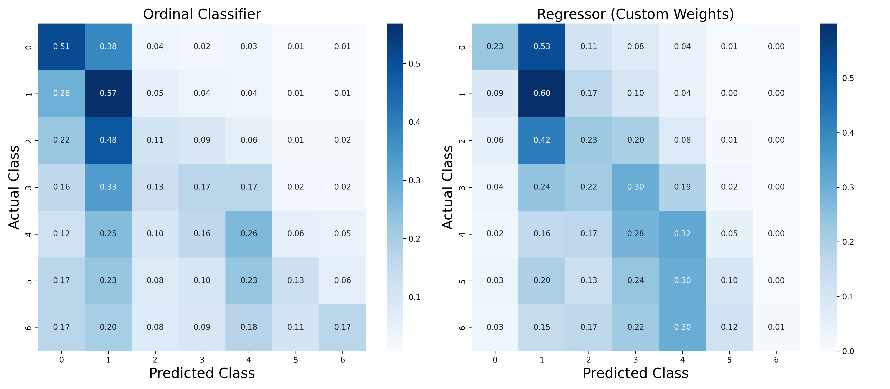

### **Alfa-Challenge**  
В рамках соревнования необходимо предсказать группу клиентов банка с минимальный балансом в следующем месяце. Значение группы (0–7) отражают уровень минимального остатка: чем выше группа, тем выше минимальный баланс. 

---

### **Структура проекта**  
- **`images/`** — вспомогательные изображения для `README.md`.  
- **`notebooks/`** — ноутбуки для обучения и анализа модели.  
- **requirements.txt** — список зависимостей.

---

### **Описание решения**  

Решение строится на задаче порядковой регрессии (Ordinal Regression). Сначала формируется набор признаков из истории транзакций для каждого клиента (см. раздел «Генерация признаков»). Затем для предсказания класса (0–7) используется комбинация:

1. Сводим задачу ordonal regression  к обучению (K−1) независимых бинарных классификаций. Где каждый классификатор оценивает, принадлежит ли объект к классу выше порога $c_i$. В нашей задаче $c_i$ принимает значение (0,1,2,...,6). Данный метод описан в [статье](https://doi.org/10.1007/3-540-44795-4_13).
2. **CatBoostRegressor** — обучается на выходных вероятностях Ordinal-классификатора и предсказывает целевое значение (0–7) напрямую. Округлённое предсказание берётся как итоговый класс.

---
### **Генерация признаков и их обработка**  

Ниже представлен итоговый вариант формирования признаков для каждого клиента:

1. **Распределение транзакций по времени суток**  
   - **Hourly/Weekday Distribution**: доля транзакций по часам и дням недели.  
   - **Time of Day Activity**: доля транзакций в различные интервалы (ночь, утро, день, вечер).  
   - **Weekend Activity**: доля транзакций, совершённых в выходные дни.

2. **Активность клиента во времени**  
   - **Avg Inactive Days**: средний интервал (в днях) между транзакциями.  
   - **Average Monthly Transactions**: среднее число транзакций в месяц.  
   - **Monthly Variance**: коэффициент вариации по месячным количествам транзакций.

3. **Анализ суммы транзакций**  
   - **Client Stats**: глобальные метрики по суммам (среднее, std, количество транзакций, коэффициент вариации).  
   - **Daily/Weekly/Monthly Aggregations**: статистики (суммы, медианы, std и т.д.) для каждого дня/недели/месяца.

4. **Анализ MCC-кодов**  
   - **Unique MCC**: количество уникальных MCC-кодов.  
   - **Category Aggregates**: суммарные/средние расходы по основным категориям (супермаркеты, рестораны, развлечения и т.д.).  
   - **Spending Ratios**: доли расходов в каждой категории относительно общего.  
   - **Rare MCC Ratio**: доля транзакций по редко встречающимся MCC-кодам.  
   - **Top-N MCC Features**: доля расходов на топ-1, топ-5 и топ-10 MCC-кодов.

5. **Признаки по мерчантам**  
   - **Unique Merchants**: количество уникальных мерчантов.

После формирования общего набора была выполнена дополнительная фильтрация:

- Удалены признаки с высокой долей пропусков (>90%).  
- Оставшиеся пропуски заменены нулями.  
- Исключены сильно коррелирующие признаки (корреляция > 0.9).

Таким образом сформирован финальный набор признаков для обучения модели.

---
### **Описание модели**

Исходная задача — **порядковая регрессия (ordinal regression)**, где классы (0–7) имеют порядок. Для её решения используется подход, при котором задача разбивается на \(K-1\) бинарных классификаций (при K=8 это 7 задач). Каждый бинарный классификатор предсказывает вероятность того, что целевая переменная больше конкретного порога $c_i$, где $c_i$ — один из порогов (0,1,2,...,6). Для обучения бинарных классификаторов используется **CatBoostClassifier** . 

Вероятности распределения по классам вычисляются следующим образом:
- $P(y=c_0) = 1 - P(y > c_0)$,
- $P(y=c_i) = P(y > c_{i-1}) - P(y > c_{i})$ для  $(i = 1, ..., K-1)$,
- $P(y=c_K) = P(y > C_{K-1})$

Далее вероятности, предсказанные бинарными классификаторами, используются для обучения дополнительной регрессионной модели, которая определяет итоговый класс. В качестве такой модели был выбран **CatBoostRegressor**, обученный с использованием функции потерь MAE.

---
### **Подбор весов для CatBoostRegressor**

1. **Целевые значения WMAE**  
   Для каждого класса $k$ целевые значения $WMAE$ были получены из публичной части лидерборда путём отправки предсказаний с фиксированным классом (все 0, все 1 и т.д.). 

2. **Постановка задачи оптимизации**  
   Задача состоит в нахождении весов $w$, которые минимизируют невязку между предсказанными и целевыми значениями $WMAE$. Каждое уравнение системы выглядит следующим образом:
   $\frac{\sum_{j=0}^6 w_j \cdot |j - k|}{\sum_{j=0}^6 w_j} = WMAE[k], \quad k = 0, 1, \dots, 6.$

4. **Метод оптимизации**  
   Для решения системы уравнений использован метод наименьших квадратов с добавлением $L2$ - регуляризации для стабилизации весов. Оптимизация проведена многократно с различными начальными условиями, чтобы избежать локальных минимумов. Более подробно о подходе и реализации метода можно ознакомиться в [ноутбуке](/notebooks/optimizing-weights-for-wmae.ipynb).

6. **Результаты оптимизации**  
   На графике ниже представлены целевые и аппроксимированные значения $WMAE$ после оптимизации весов:  

    .

---
### **Сплит данных**

Изначальный тренировочный датасет (70 000 клиентов) был разделён следующим образом:

- **Тренировка Ordinal Regression**: ~68% (47 600 клиентов)  
- **Тренировка Regresser**: ~17% (11 900 клиентов)  
- **Валидация**: ~15% (10 500 клиентов)

---

### **Результаты**

Ниже приведены итоговые метрики на валидационном наборе:

| Модель                  | F1 (Macro) | F1 (Weighted) | MAE    | Private Score | Public Score |
|-------------------------|-----------:|--------------:|-------:|--------------:|-------------:|
| **Ordinal Classifier**  | 0.2749     | 0.3185        | 1.3114 | 0.74562       | 0.75707      |
| **Regressor**           | 0.2313     | 0.2756        | 1.1958 | 0.73143       | 0.74158      |

- По **F1 (macro/weighted)** лучше себя показывает Ordinal Classifier.  
- По **MAE** — лучше Regressor (что важно в задаче, где основной критерий — WMAE).

Ниже приведены нормированные матрицы ошибок для обоих подходов. Каждая матрица строится следующим образом:  
- **Строки** соответствуют **фактическому** классу.
- **Столбцы** соответствуют **предсказанному** классу.  
- В ячейках указаны доли объектов для каждого фактического класса, распределённые по предсказанным значениям. Это позволяет оценить, насколько часто модель ошибается и к каким классам относит объекты.

 

---

## **Как можно улучшить решение**

- **Дополнительный feature engineering**. Например, попробовать реализовать кластеризацию клиентов и использовать полученные кластеры в качестве новых признаков.  
- **Тюнинг гиперпараметров**, используемых моделей с помощью **Optuna**.  
- **Ансамблирование** нескольких моделей.  
- **Улучшить отбор признаков**. Например, удалять фичи с низкой значимостью (feature importance) при обучении классификационных моделей.
